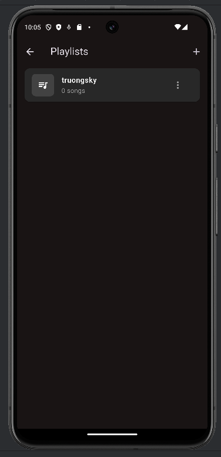
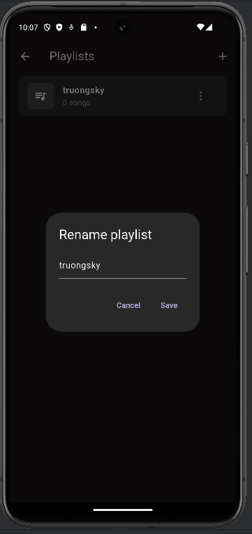
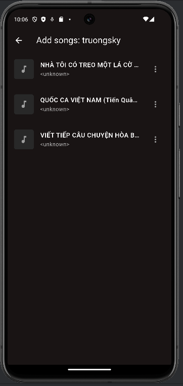
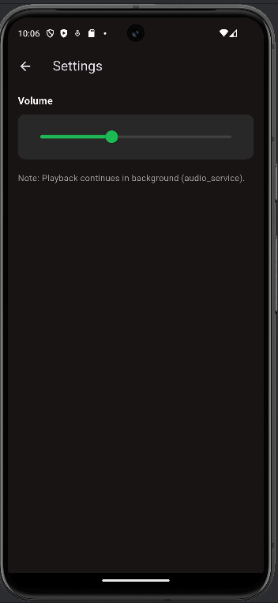

# 🎵 Ứng dụng Nghe Nhạc Offline Flutter – *offline_music_player*

Ứng dụng Flutter cho phép **nghe nhạc offline** trực tiếp từ bộ nhớ thiết bị, hỗ trợ tìm kiếm bài hát, phát nhạc nền, quản lý playlist cá nhân và giao diện Dark Mode hiện đại.

---

## 📌 Mục lục

- [Giới thiệu](#-giới-thiệu)
- [Tính năng](#-tính-năng)
- [Kiến trúc & Công nghệ](#-kiến-trúc--công-nghệ)
- [Screenshots](#-screenshots)
- [Cài đặt & Chạy ứng dụng](#-cài-đặt--chạy-ứng-dụng)
- [Cấu trúc thư mục](#️-cấu-trúc-thư-mục)
- [Hướng phát triển](#-hướng-phát-triển)
- [Thông tin sinh viên](#-thông-tin-sinh-viên)

---

## 🌟 Giới thiệu

`offline_music_player` là ứng dụng Flutter giúp người dùng:

- Quét và hiển thị nhạc có sẵn trong bộ nhớ thiết bị
- Nghe nhạc **không cần Internet**
- Điều khiển phát nhạc với giao diện trực quan
- Tạo và quản lý playlist cá nhân
- Tìm kiếm và lọc bài hát nhanh chóng

Ứng dụng được xây dựng phục vụ **bài nộp môn Thực hành Phát triển Ứng dụng Di động**.

---

## 🚀 Tính năng

### 🎶 Phát nhạc
- Phát nhạc offline từ bộ nhớ thiết bị
- Play / Pause / Next / Previous
- Thanh tiến trình (seek bar)
- Mini Player hiển thị khi đang phát

### 🔍 Tìm kiếm & Lọc bài hát
- Tìm kiếm theo:
    - Tên bài hát
    - Nghệ sĩ
    - Album
- Lọc danh sách nhạc theo thời gian thực khi nhập từ khóa

### 📂 Playlist
- Tạo playlist mới
- Đổi tên playlist
- Xóa playlist
- Thêm / xóa bài hát trong playlist
- Xem danh sách bài hát của playlist

### 🔐 Quyền truy cập
- Xin quyền truy cập Audio / Media trên Android
- Hiển thị màn hình yêu cầu quyền nếu chưa được cấp
- Hướng dẫn mở Settings để cấp quyền

### 🎧 Now Playing
- Màn hình phát nhạc riêng biệt
- Hiển thị tên bài hát, nghệ sĩ
- Nút shuffle / repeat
- Thanh thời gian phát nhạc

---

## 🏗️ Kiến trúc & Công nghệ

| Công nghệ | Mô tả |
|----------|-------|
| Flutter | UI framework |
| Dart | Ngôn ngữ lập trình |
| Provider | Quản lý state |
| just_audio | Phát nhạc |
| audio_service | Phát nhạc nền |
| on_audio_query | Quét nhạc từ thiết bị |
| permission_handler | Xin quyền truy cập |
| sqflite | Lưu playlist |
| Material UI | Giao diện |

---

## 📸 Screenshots

### Bảng hình ảnh minh họa giao diện

| Ảnh | Mô tả |
|-----|------|
|  | 🏠 My Music – Danh sách nhạc & tìm kiếm |
|  | 🎧 Now Playing – Màn hình phát nhạc |
|  | 📂 Playlist – Danh sách playlist |
|  | ➕ Tạo playlist mới |
|  | ✏️ Đổi tên playlist |
|  | ➕ Thêm bài hát vào playlist |
|  | ⚙️ Màn hình cài đặt |

---

## ⚙️ Cài đặt & Chạy ứng dụng

### 1️⃣ Cài dependencies

---
flutter pub get
2️⃣ Chạy ứng dụng
flutter run
🗂️ Cấu trúc thư mục
## 📁 Cấu trúc thư mục


```txt
offline_music_player/
├─ android/
├─ ios/
├─ assets/
│  ├─ audio/
│  └─ images/
├─ lib/
│  ├─ models/
│  ├─ providers/
│  ├─ screens/
│  ├─ services/
│  ├─ utils/
│  ├─ widgets/
│  └─ main.dart
├─ Screenshots/
│  ├─ MyMusicScreen.png
│  ├─ NowPlayingScreen.png
│  ├─ PlaylistScreen.png
│  ├─ CreatePlayList.png
│  ├─ RenamePlayList.png
│  ├─ addSongPlayList.png
│  └─ SettingsplayList.png
├─ pubspec.yaml
└─ README.md